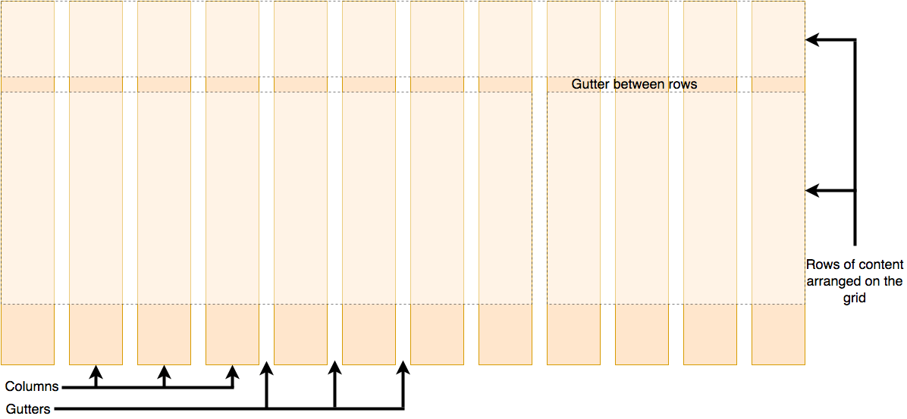

# 1. Tìm hiểu về Grid System

## Grid system là gì?

-   `Grid system` **là một nguyên tắc, hệ thống lưới** để tổ chức và căn chỉnh các phần tử trên trang web.
-   Grid system hỗ trợ giàn trang, layout, responsive.
-   Grid system tạo ra một cấu trúc có tổ chức, dễ đọc và dễ quản lý, giúp tạo trang web đồng nhất và chuyên nghiệp.

## Các khái niệm trong Grid system

Grid system có bốn khái niệm:

-   `container`: là **thẻ cha dùng** để bọc layout tổng thể, **giới hạn kích thước nội dụng của trang web**.

-   `row`: **là hàng**, dùng để bọc các cột.

-   `column`: **là cột**.

-   `gutter`: **là rãnh (khoảng cách) giữa các cột trong hàng**
